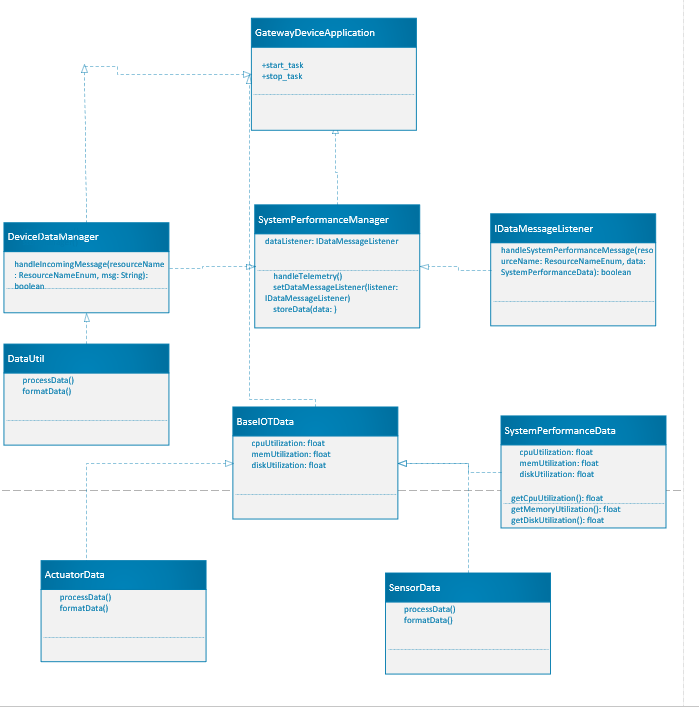

# Gateway Device Application (Connected Devices)

## Lab Module 05

Be sure to implement all the PIOT-GDA-* issues (requirements) listed at [PIOT-INF-05-001 - Lab Module 05](https://github.com/orgs/programming-the-iot/projects/1#column-10488421).

### Description

NOTE: Include two full paragraphs describing your implementation approach by answering the questions listed below.

What does your implementation do? 

The implementation in the Gateway Device Application facilitates the management and processing of actuator and sensor data. It includes the DeviceDataManager, which orchestrates the operation of various components like MQTT clients, CoAP servers, and cloud connectors. This application acts as the central hub for gathering data from sensors, issuing commands to actuators, and handling system performance data. The addition of the DataUtil class enhances data handling capabilities by providing utility methods for data formatting and validation.

How does your implementation work?

The DeviceDataManager initializes and manages connections to different services based on the configuration settings. It listens for incoming data messages through the IDataMessageListener interface, handling actuator commands and sensor messages appropriately. When new data is received, it processes it, potentially invoking other components to perform actions based on the received commands. The DataUtil class aids in this process by offering reusable methods for data manipulation, ensuring that the data structures align with the predefined constants and configurations.

### Code Repository and Branch

NOTE: Be sure to include the branch (e.g. https://github.com/programming-the-iot/python-components/tree/alpha001).

URL: https://github.com/stay-stay/java-components/tree/lab005
	
### UML Design Diagram(s)

NOTE: Include one or more UML designs representing your solution. It's expected each
diagram you provide will look similar to, but not the same as, its counterpart in the
book [Programming the IoT](https://learning.oreilly.com/library/view/programming-the-internet/9781492081401/).

### Unit Tests Executed

NOTE: TA's will execute your unit tests. You only need to list each test case below
(e.g. ConfigUtilTest, DataUtilTest, etc). Be sure to include all previous tests, too,
since you need to ensure you haven't introduced regressions.
-	ConfigUtilTest
-	DataUtilTest
-	DeviceDataManagerTest
-	ActuatorDataTest
-	SensorDataTest

### Integration Tests Executed

NOTE: TA's will execute most of your integration tests using their own environment, with
some exceptions (such as your cloud connectivity tests). In such cases, they'll review
your code to ensure it's correct. As for the tests you execute, you only need to list each
test case below (e.g. SensorSimAdapterManagerTest, DeviceDataManagerTest, etc.)

-	SensorSimAdapterManagerTest
-	DeviceDataManagerTest
-	CloudClientConnectorTest
-	CoapServerGatewayTest

EOF.
